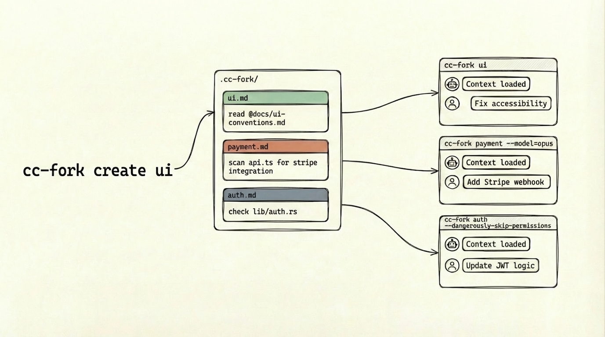

# cc-fork



Stop repeating yourself every time you start a new Claude Code session. cc-fork helps you create and manage Claude Code sessions with pre-loaded codebase context.

## The Problem

When working with Claude Code on complex codebases, you often need to spend the first few minutes guiding Claude to understand your project before you can get to actual work. If you work on the same codebase across multiple sessions, you repeat this onboarding ritual every single time.

## The Solution

`cc-fork` lets you create reusable **base sessions** — kickstart prompts that prime Claude with your codebase knowledge. Fork from a base session anytime to get a new working session with context pre-loaded.

**Create once, fork forever.**

## Installation

```bash
npm install -g cc-fork
```

Also available as `ccfork`. Requires [Claude Code](https://docs.anthropic.com/en/docs/claude-code).

## Quick Start

```bash
# One-time setup: create a base session
cc-fork create payments
# Opens your editor — write a prompt that guides Claude through relevant code

# Daily usage: fork when you need to work
cc-fork payments
# Launches Claude with full context, ready for your questions
```

## Key Features

- **Shareable prompts** — Session files contain only your prompt, safe to commit and share with your team
- **Local session state** — Session IDs stored in `~/.cc-fork/`, so no git noise when refreshing
- **Survives re-clones** — Sessions persist across repo re-clones (same git remote)
- **Stale prompt detection** — Warns when your prompt changed since last refresh

## Workflows

### Basic: Create Once, Fork Forever

```bash
cc-fork create payments    # One-time setup
cc-fork payments           # Daily usage (shorthand for `cc-fork fork payments`)
```

### Cost-Effective: Build with Haiku, Work with Opus

```bash
cc-fork create payments --model haiku   # Cheap context building
cc-fork payments --model opus           # Powerful reasoning
```

### Incremental: Evolve Your Base Session

```bash
cc-fork use payments       # Resume base session, add more context
cc-fork payments           # Future forks include the new context
```

### Maintenance: Keep Sessions Fresh

```bash
cc-fork refresh payments   # Rebuild after major codebase changes
```

## Commands

| Command | Description |
|---------|-------------|
| `create <name>` | Create a new base session (alias: `new`) |
| `fork <name>` | Fork from base session (default command) |
| `use <name>` | Resume base session directly |
| `refresh <name>` | Rebuild with new session ID (alias: `rebuild`) |
| `list` | List all sessions |
| `edit <name>` | Open session in editor |
| `delete <names...>` | Delete sessions |

## How It Works

Sessions are stored as markdown files in `.claude/cc-fork/`:

```
.claude/cc-fork/
├── payments.md      # your prompt + Claude flags
├── auth.md
└── checkout.md
```

Commit these files to share prompts with your team. Session state (IDs, timestamps) is stored locally in `~/.cc-fork/` and never committed.

---

## Reference

### CLI Options

**create:**
- `-p, --prompt <text>` — Provide prompt inline, skip editor
- `-i, --interactive` — Enter Claude Code after prompt (default: true)

**refresh:**
- `-i, --interactive` — Enter Claude Code after prompt (default: true)

**delete:**
- `-f, --force` — Skip confirmation

### Claude CLI Flags

Any `claude` CLI flag can be passed through. Flags resolve from (highest precedence first):

1. **CLI arguments** — `cc-fork payments --model opus`
2. **Session frontmatter** — YAML header in the markdown file

Flags passed during `create` are persisted in frontmatter.

### Project Configuration

Configure cc-fork via `.claude/cc-fork/config.yaml`:

```yaml
interactive: false      # disable interactive mode (default: true)
defaultCommand: use     # what `cc-fork <name>` runs (default: fork)
projectId: my-team-app  # override automatic project identification
```

For Claude Code settings (model, permissions), use `.claude/settings.json`.

### Flag Conversion

| YAML | Claude CLI |
|------|------------|
| `model: haiku` | `--model haiku` |
| `dangerously-skip-permissions: true` | `--dangerously-skip-permissions` |
| `dangerously-skip-permissions: false` | *(omitted)* |
| `allowedTools: ["Bash(git *)", "Read"]` | `--allowedTools "Bash(git *)" "Read"` |

Boolean `false` means "don't pass this flag" — useful for overriding a session-level `true`.

## License

MIT
